# Analysis Report

### Summary of the Goodreads Dataset

The dataset consists of 10,000 entries of book information from Goodreads, capturing various attributes that can provide meaningful insights into readers' preferences and trends in published literature. Below, we discuss key insights drawn from the dataset analysis and visualizations, along with their implications.

#### 1. **Book Identification and Diversity**
- The dataset features unique identifiers for each book, including `book_id`, `goodreads_book_id`, `best_book_id`, and `work_id`. The mean `book_id` is approximately 5000, with a standard deviation suggesting a wide range of identifiers, indicating a diverse range of books.
- The presence of 4664 unique authors demonstrates the variety of contributors to the literature captured in this dataset. Notably, Stephen King recorded the highest frequency among authors, reflecting his popularity and the impact of his works on contemporary literature.

#### 2. **Publication Trends**
- The `original_publication_year` averages around 1982, with a wide range from as early as -1750 to 2017. This suggests that the dataset encompasses a mix of classic and contemporary literature. The concentration of books published post-2000 signals an increasing influx of new literature, which could be significant in analyzing trends in genres and themes.

#### 3. **ISBN Availability**
- A substantial portion (700) of entries lack an ISBN (International Standard Book Number), with 585 entries also missing ISBN13. This presents challenges in metadata consistency and book identification, which may hinder efforts to catalog or recommend books effectively.

#### 4. **Ratings and Reviews**
- The average rating across entries is approximately 4.00, suggesting that the majority of the books tend to be well-received by readers. The distribution of ratings shows a relatively balanced interest across all categories, with a notable amount of ratings concentrated in the 5-star category (mean of 23789.8 for ratings_5), indicating that readers are likely to express strong approval for their choices.
  
- The total count of ratings (`ratings_count`) and reviews (`work_text_reviews_count`) reflects a highly engaged readership that actively rates and reviews books. The average `ratings_count` is about 54,001, which suggests that popular titles receive significant attention and engagement.

#### 5. **Language Diversity**
- The dataset includes books in 25 different languages, with English (language code 'eng') showing the highest frequency at 6,341 entries. This emphasizes the dominance of English literature in the dataset and can indicate a need to expand the dataset to incorporate more diverse language representations.

#### 6. **Impact of Visual Representation**
- The visual distributions of various metrics, from book ID distributions to ratings, provide crucial insights into common patterns in reading preferences. For instance, a skewed distribution in the `average_rating` and `ratings_count` visualizations highlight the popularity of certain books while indicating opportunities for lesser-known titles to gain visibility.

### Key Implications

1. **Curated Recommendations**: The high average rating implies that recommendations based on top-rated titles can resonate well with users. This could serve as a strategy for developing personalized reading lists or thematic lists that could enhance user engagement on platforms like Goodreads.

2. **Targeted Marketing**: Emerging trends from publication years indicate that newer publications are gaining traction. This suggests an opportunity for marketing campaigns that focus on contemporary titles, particularly those exhibiting modern themes that align with current reader interests.

3. **Diversity in Literature**: Emphasizing a strategy to include diverse authorship, particularly from underrepresented genres or languages, could lead to a richer literary experience for readers, appealing to a more global audience.

4. **Improving Data Integrity**: The missing ISBN numbers highlight the importance of data cleaning and verification processes in maintaining metadata integrity. Addressing these gaps can enhance the accuracy and reliability of recommendations and analytics going forward.

5. **Future Research Opportunities**: This dataset opens avenues for further research into literary trends, shifts in reader preferences over time, and correlations between ratings and demographic or thematic variables in the literature.

In conclusion, this dataset serves as a valuable tool for understanding reader engagement on Goodreads, providing insights into historical and contemporary literary trends, and paving the way for targeted recommendations and marketing strategies in the literary space.

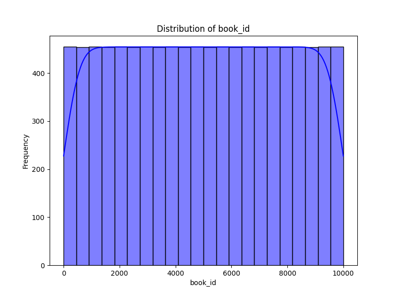

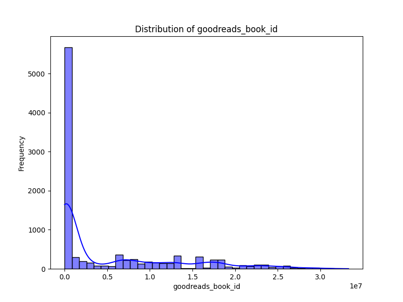

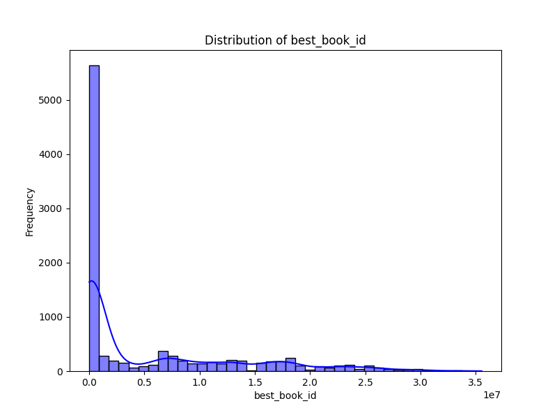

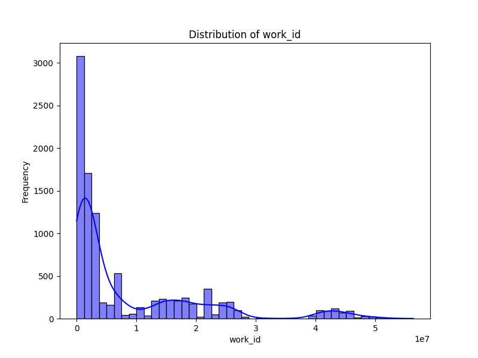

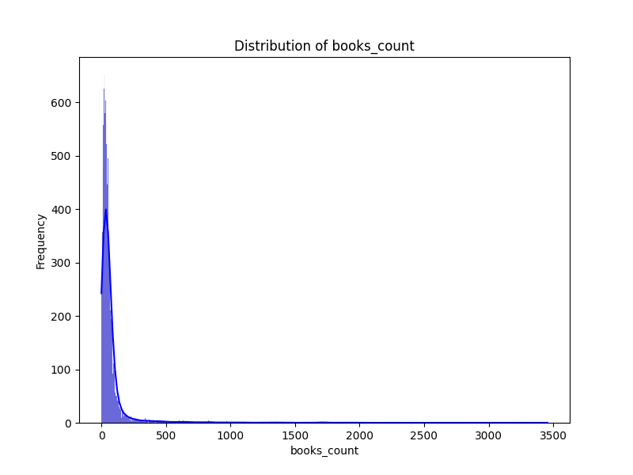

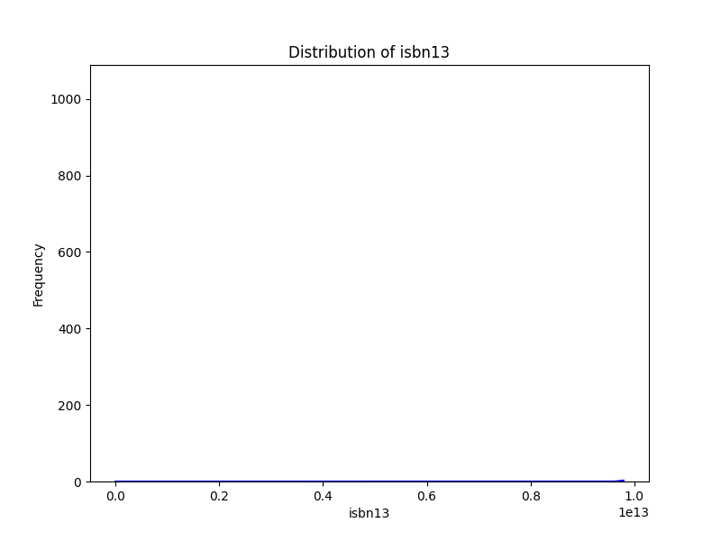

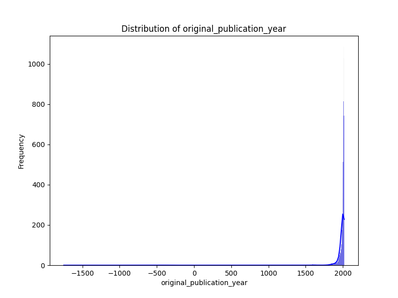

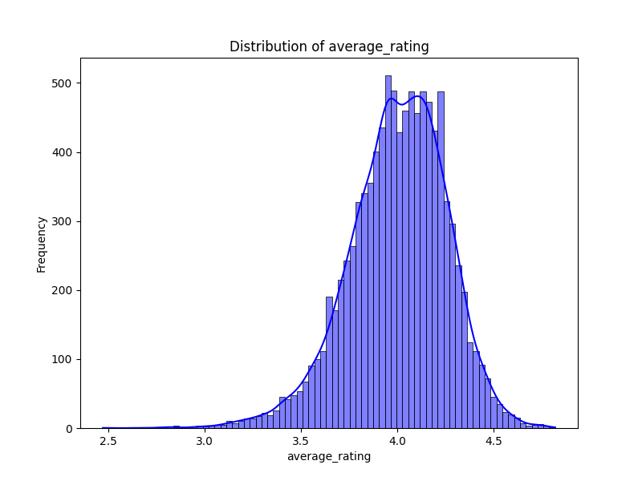

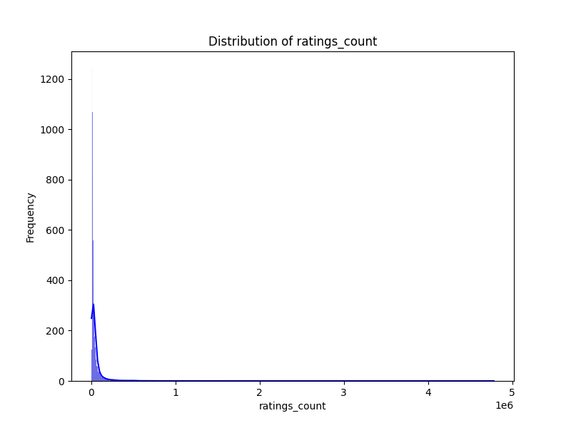

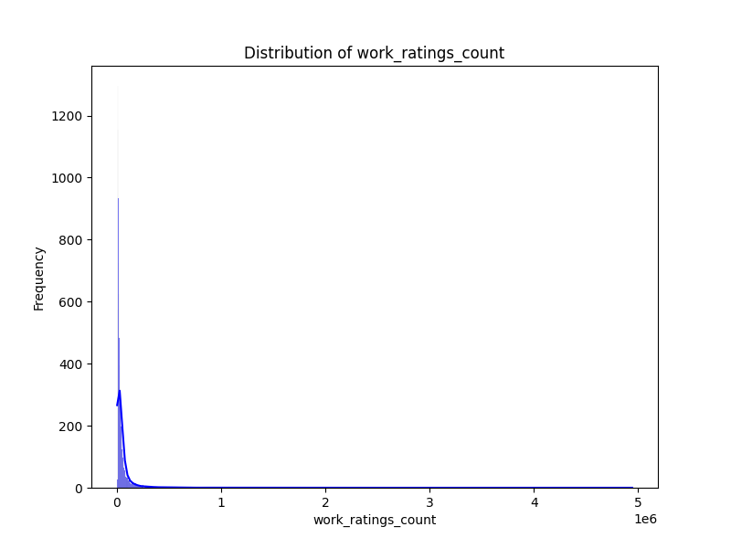

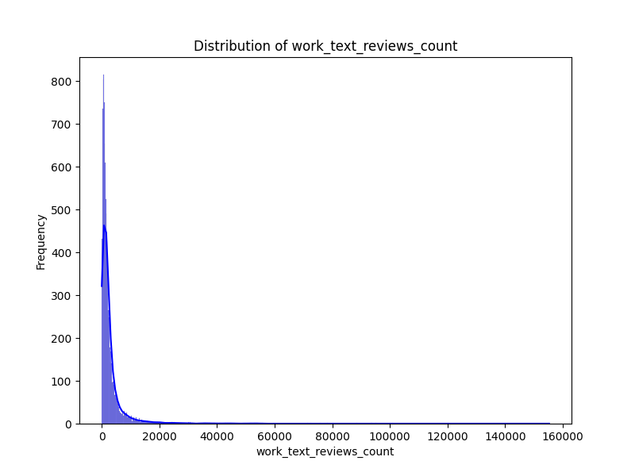

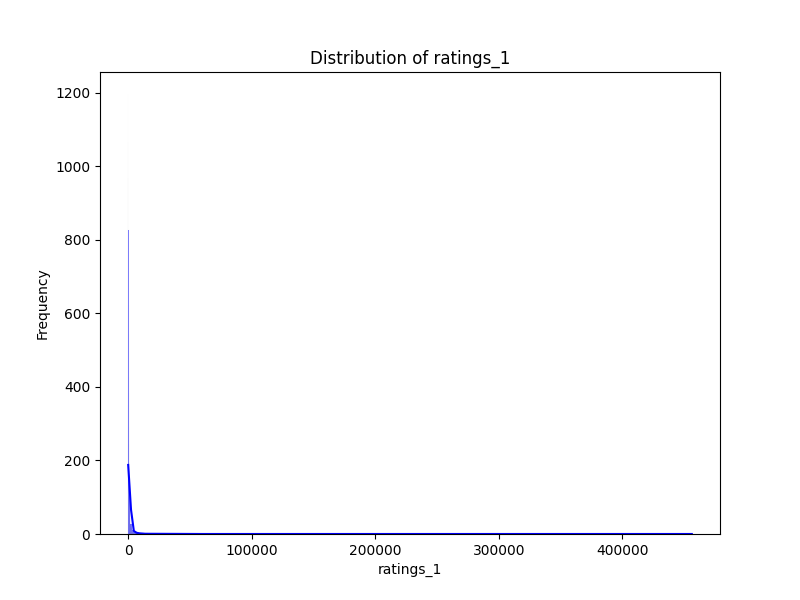

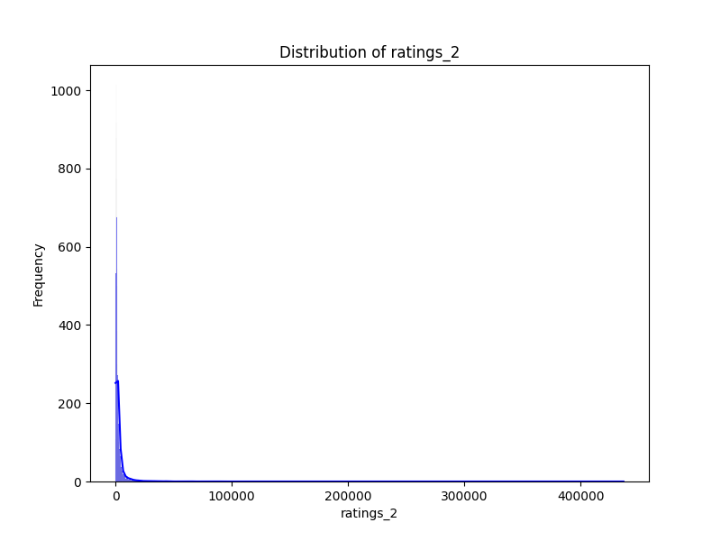

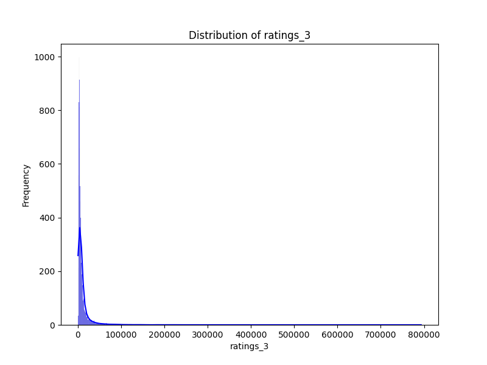

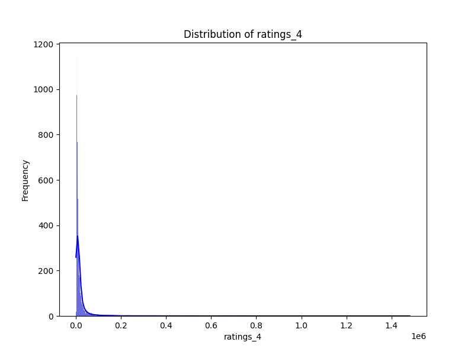

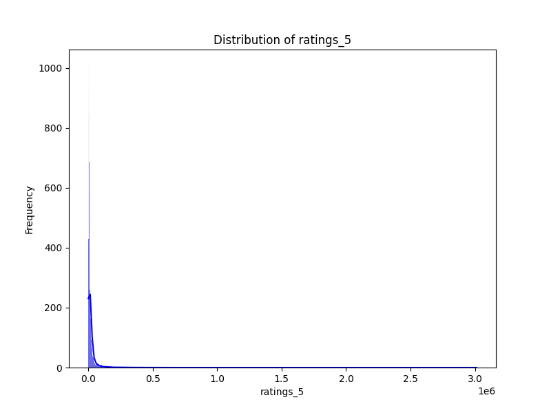

