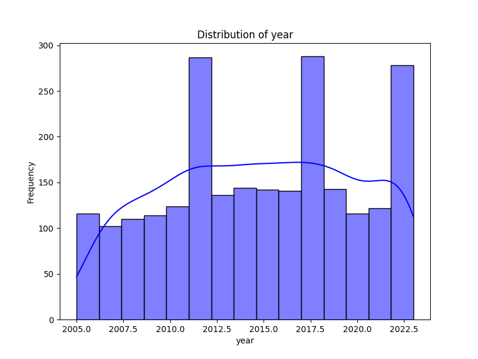
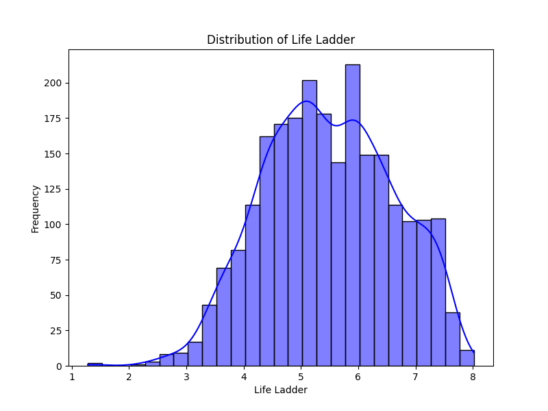
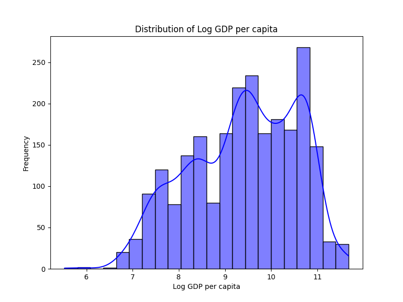
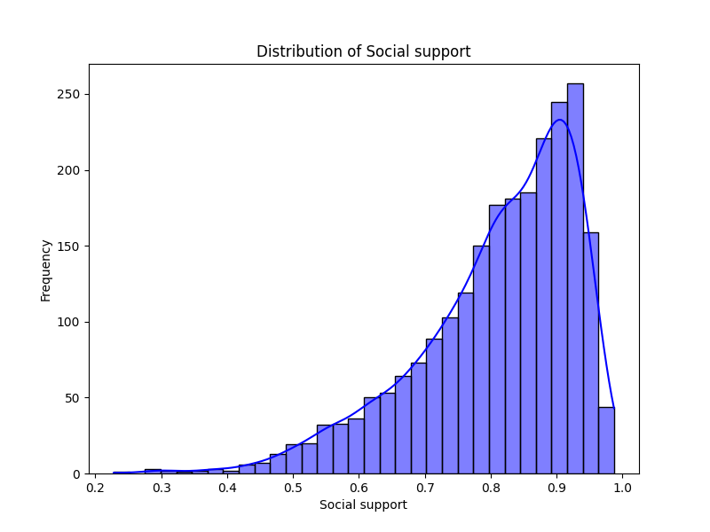
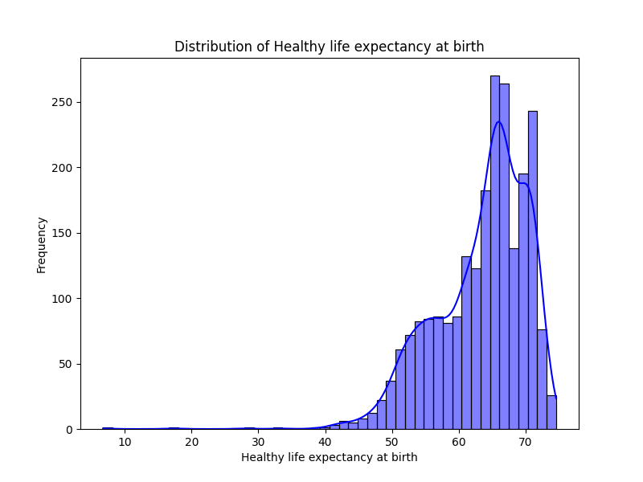
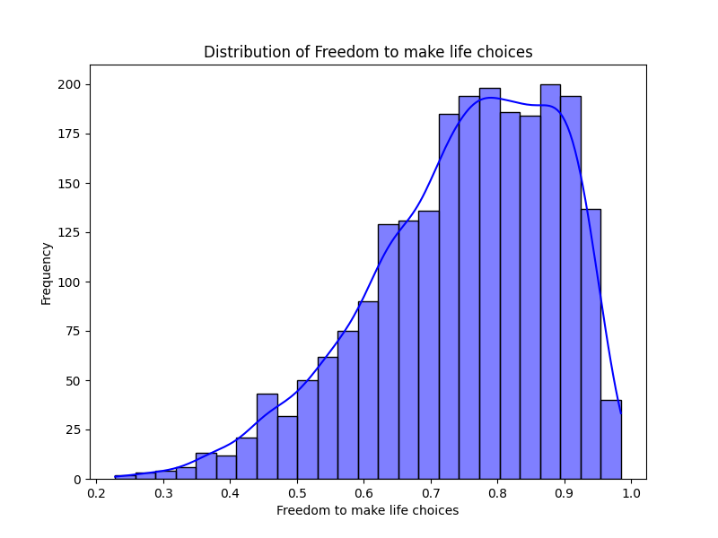
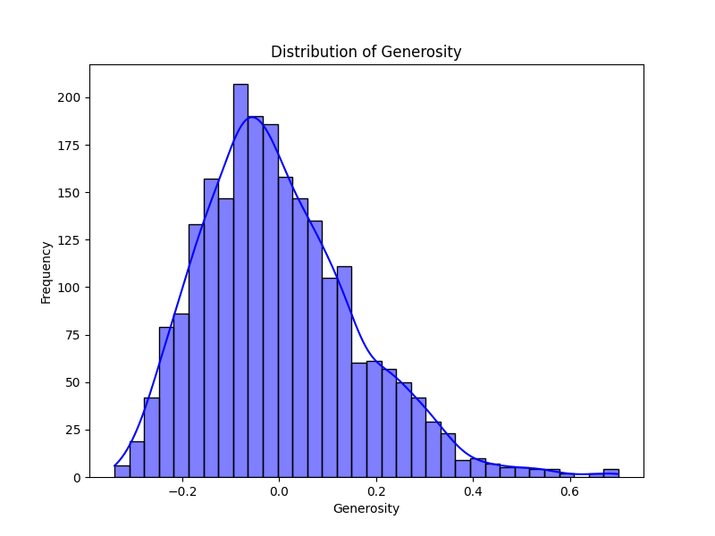
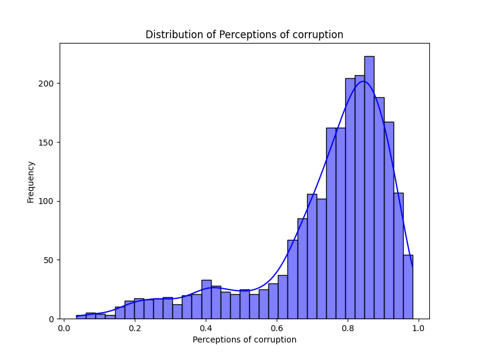
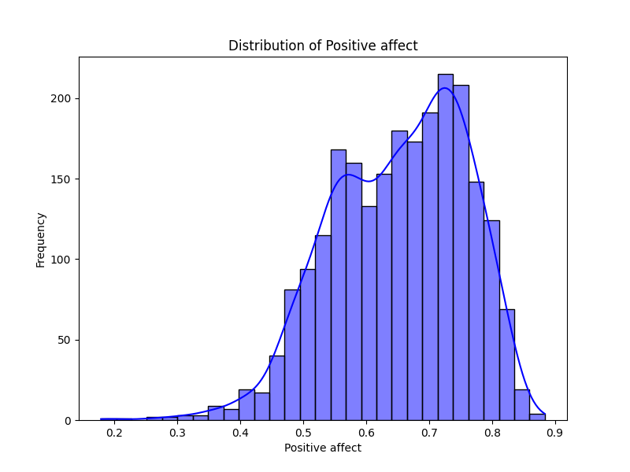
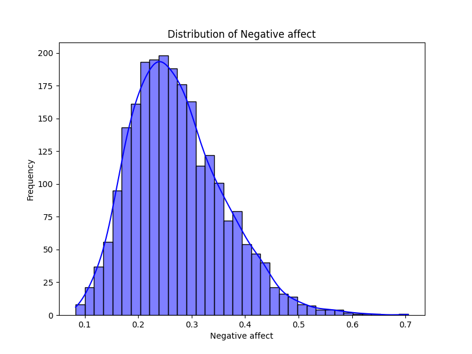

# Analysis Report

### Story Summary of Happiness Dataset

#### Introduction
The dataset captures a wealth of information aimed at understanding the factors contributing to happiness across various countries over multiple years. It consists of 2,363 observations across 11 variables, focusing on key dimensions like economic performance, social support, health, and freedom, along with how these correlate to people's happiness, measured by the "Life Ladder" score.

#### Key Insights

1. **Yearly Trends**:
   - The average year across the dataset is roughly 2014, with data spanning from 2005 to 2023. This temporal range allows us to track changes and improvements in happiness levels and other indicators over time.

2. **Life Ladder and Happiness**:
   - The average Life Ladder score is approximately 5.48, indicating a moderate level of reported happiness globally. The distribution shows that a significant number of countries score below the median (5.45), suggesting that many face challenges in enhancing citizen well-being.

3. **Economic Influence: Log GDP per Capita**:
   - The mean Log GDP per capita is around 9.4, signifying a strong correlation between economic prosperity and happiness. Notably, missing values in this variable (28 entries) hint at potential economic struggles in some nations, which could impact their overall happiness.

4. **Social Support**:
   - With an average score of 0.81, social support emerges as a crucial factor in affecting happiness. This dimension peaked among nations with robust social safety nets, indicating that societies with stronger communal bonds may enhance overall life satisfaction.

5. **Health Factors: Healthy Life Expectancy**:
   - An average healthy life expectancy at birth of about 63.4 years provides insights into how life expectancy correlates with happiness. A considerable number of missing entries (63) suggest health system shortcomings in certain countries, which could adversely affect their happiness levels.

6. **Freedom to Make Life Choices**:
   - With an average score of 0.75, freedom is deeply intertwined with people's perceived happiness. The distribution indicates that nations promoting personal liberty tend to report higher Life Ladder scores, further emphasizing the importance of autonomy in life satisfaction.

7. **Generosity and Corruption**:
   - The average score for Generosity is alarmingly low (close to zero), while the Perceptions of Corruption average is 0.74. This signals that while some countries may contribute generously, systemic corruption undermines trust and overall happiness, forming a complex web of societal challenges.

8. **Emotive Factors: Positive and Negative Affect**:
   - The average Positive Affect score is 0.65, contrasting with the Negative Affect score of 0.27. Countries reporting higher positive feelings tend to have better overall Life Ladder scores, highlighting the emotional dimensions of happiness which could be nurtured through positive societal development initiatives.

#### Implications

- **Policy Development**: Insights from this dataset can inform governments and policymakers focusing on enhancing citizen happiness. By prioritizing economic stability, health, social welfare, and freedom, countries can enhance overall well-being.

- **Addressing Inequality**: The substantial missing values in some key indicators, especially for Generosity and Freedom to Make Life Choices, point towards significant inequalities. Targeted policies aimed at uplifting disadvantaged communities are critical.

- **Cultural Considerations**: Different cultural dimensions play a role in how happiness is perceived and defined. As such, interventions designed to enhance happiness must consider local contexts and cultural dynamism.

- **Long-term Strategies**: Monitoring changes over the years encourages a longitudinal approach. Understanding the evolution of happiness-related metrics can help in targeting specific areas for improvement, creating sustainable strategies for enhanced life satisfaction.

#### Conclusion
This dataset paints a compelling picture of global happiness and the various dimensions that influence it. The interconnections between economic factors, social support, health, freedom, and emotional wellbeing present both challenges and opportunities. By addressing these key areas, nations can work towards cultivating an environment that fosters happiness and enhances the quality of life for all citizens.

