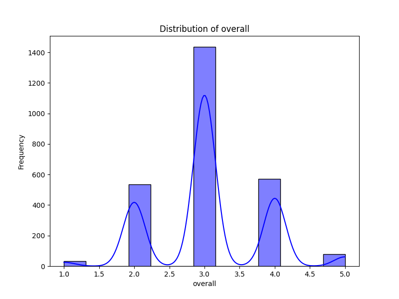
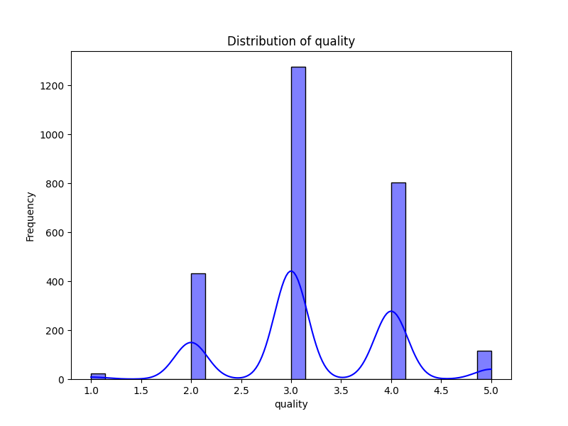
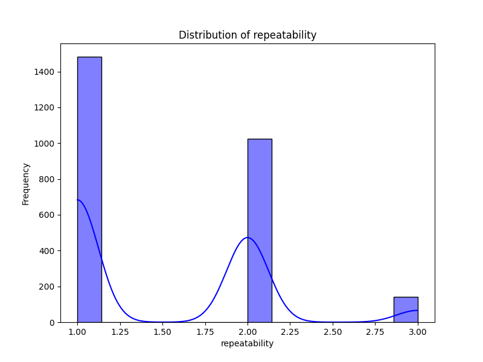

# Analysis Report

### Story Summary of the Dataset

#### Introduction

The dataset comprises 2,652 entries across eight attributes, encapsulating various aspects of media, specifically focusing on their reviews and ratings. The attributes include the review date, language, media type, title, reviewer, and three distinct rating categories: overall, quality, and repeatability. This analysis aims to illuminate critical patterns within the dataset and derive insights pertinent to the media landscape.

#### Key Insights

1. **Missing Values Analysis**:
   - Notably, the dataset contains significant missing data in the 'by' column, with 262 entries lacking a recorded reviewer. This degree of missingness is concerning because it may skew insights regarding reviewer influence on ratings and might hinder efforts to normalize data assessments.
   - The 'date' field also has missing values, with 99 unrecorded dates. This deficiency could restrict temporal analysis of trends and patterns.

2. **Demographics of the Dataset**:
   - The dataset showcases media in 11 languages, dominated by English, which appears in over half of the entries (1,306). This concentration suggests a possible global bias toward English-language media within the sample.
   - Media types are diversified, including at least eight classifications, with the category 'movie' being overwhelming popular (appearing 2,211 times). This may signal a prevailing consumer preference but also indicates a potential skew in data representation concerning other media types.

3. **Rating Distributions**:
   - **Overall Ratings**: The mean overall rating is 3.05 with a standard deviation of 0.76. The ratings predominantly cluster around the mid-point of the scale. The histogram visualization of overall ratings reinforces this trend, revealing a slight right-skew towards higher ratings, indicating that most reviewers express a favorable opinion toward the media reviewed.
   - **Quality Ratings**: Averaging 3.21, quality ratings display a similar distribution pattern to overall ratings. The clustering around the middle of the rating scale reflects common consumer sentiment but raises questions about potential rating inflation or biases in the evaluation process.
   - **Repeatability Ratings**: With a mean of 1.49 and a standard deviation of 0.60, repeatability ratings are significantly lower than overall and quality ratings. The underwhelming repeatability scores suggest a perception of lower rewatch or revisit value, potentially signaling that while the media may be received well initially, they may not hold long-term appeal.

#### Implications

1. **Consumer Preferences**: The dataset signals a need for media creators and marketers to understand consumer preferences. The focus on movies and English-language productions suggests a lucrative market but can represent an oversight of non-English productions, which could be valuable if adequately marketed.

2. **Quality vs. Repeatability**: The divergence between quality and repeatability ratings may indicate that reviewers are content with the quality of the media but do not see substantial value in watching it again. This gap should be analyzed further, as it may affect future production decisions and marketing themes.

3. **Item Selection Process**: The variety of languages and media types suggests that inclusivity in selection could enhance market reach. It might be wise for producers to analyze niche markets and explore opportunities in underrepresented genres and languages.

4. **Addressing Missing Values**: The extent of missing values, especially in the reviewer column, raises concerns about the robustness of the dataset. Addressing this issue—either through imputation methods or by improving data collection strategies in the future—will increase the dataset's reliability and usefulness for informed decision-making.

5. **User Engagement Strategies**: Media entities could employ the insights gathered from the dataset to refine their user engagement strategies. For example, if the repeatability scores remain low, efforts could be directed toward crafting more engaging and replayable content.

#### Conclusion

The analysis of this dataset reveals valuable insights into media trends, ratings, and consumer preferences. As the media landscape continues to evolve, employing these insights strategically could enhance production quality while catering to audience expectations, ultimately fostering more fulfilling viewing experiences across diverse demographics. The collaborative effort to close the gaps in data could also enhance future analyses and projections for the industry at large.

